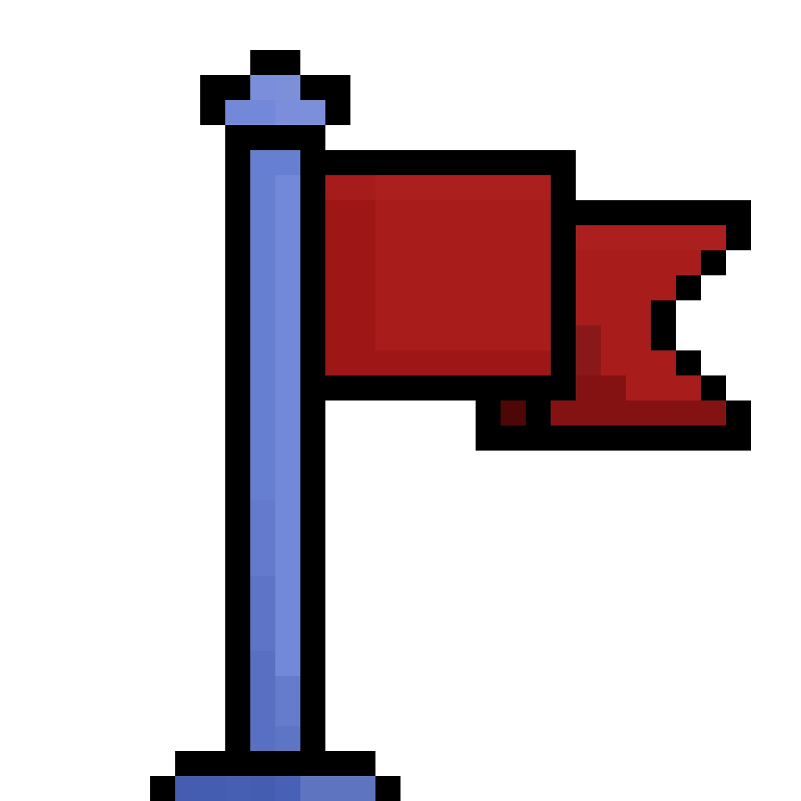
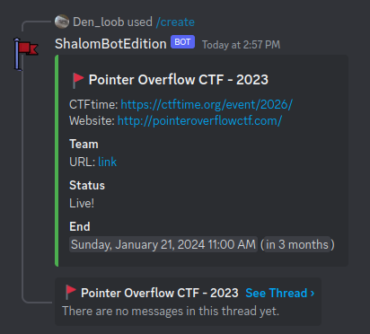
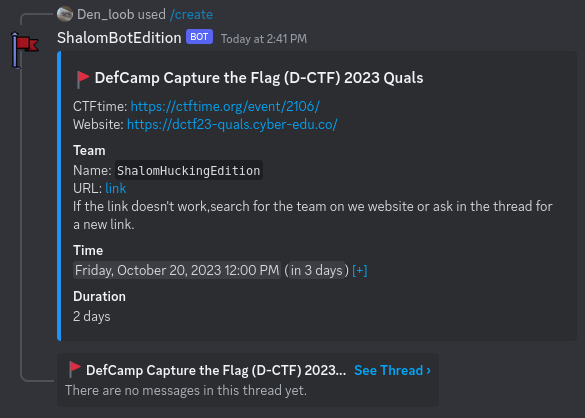

# Flag Catcher



## Screenshots




## Features

- [CTFtime](https://ctftime.org/) integration: get the ID of the CTF on CTFtime
    and the bot will fetch all the information on it's own. No manual work required!
- Full date and relative time until the end or the start of the CTF.
- Automatic CTF status update.
- Receive optional notification when the CTF begins.
- Add your team credentials to the CTF message so your teammates can join right away.

## Getting Started

### Dependencies
- [D++](https://dpp.dev/)
- [JsonCpp](https://github.com/open-source-parsers/jsoncpp)
- [curl](https://github.com/curl/curl)

### Building from source
After installing the dependencies, clone the repo and cd into it.
```sh
git clone --recursive https://github.com/Denloob/flag-catcher.git
cd flag-catcher
```
Then compile using `cmake`
```sh
cmake .
cmake --build .
```

You can find the bot binary in `bin/`.

### Running

First, to run the Discord bot you will need a token. You can follow
[D++ awesome tutorial](https://dpp.dev/creating-a-bot-application.html).

After you acquire a token, you have two options to run the bot:
- Provide the token using an environment variable `BOT_TOKEN`.
- Provide the token from standard input.

If `BOT_TOKEN` is not set, the bot will try to input the token. Thus allowing you to pipe the token from a file into the executable.


Also, the first time you run the bot, you need to provide it the `--recreate-commands` flag to register the slash commands.
You don't need this flag again unless the commands are updated.

For example:
(In this example a fake token is used.)
```sh
den ~/d/c/ (main)> cat ./token.txt
MTA5Nzg2MzY5MzU4NjQxOTkyMg.GyPY7w.x1g95vvQxlh_aelDpoxhQIz0TjLechlA3M7ZG4
den ~/d/c/ (main)> cat ./token.txt | ./bin/discord-bot --recreate-commands
[2023-10-17 15:34:36] DEBUG: Cluster: 1000 of 1000 session starts remaining
[2023-10-17 15:34:36] INFO: Auto Shard: Bot requires 1 shard
[2023-10-17 15:34:36] DEBUG: Starting with 1 shards...
[2023-10-17 15:34:36] DEBUG: Connecting new session...
[2023-10-17 15:34:36] INFO: Shard id 0 (1/1) ready!
[2023-10-17 15:34:36] DEBUG: Resume URL for session 8d3f8dbe5f033748a2a82528a0ea2e92 is wss://gateway-us-east1-d.discord.gg (host: gateway-us-east1-d.discord.gg)
[2023-10-17 15:34:41] DEBUG: Shards started.
```

### Using the bot

Congratulations! Your bot is now up and running! The only thing left is to use it.

First invite it to your discord server. You can find how to generate the invite
link the the same [D++ tutorial](https://dpp.dev/creating-a-bot-application.html).
Now open a channel where you want to create the CTF.

To create a CTF use the `/create` slash command. You need to provide an ID of a
CTF. You can find the ID by going to [CTFtime](https://ctftime.org/), choosing
an event you want to participate in and copying the ID in the URL.
For example [DefCamp Capture the Flag (D-CTF) 2023 Quals](https://ctftime.org/event/2106)
has the URL `https://ctftime.org/event/2106`, which means the ID is `2106`.
Now we can execute the command `/create id:2106` to create a CTF!

That's it!

If you want to add additional info, like who to ping on CTF start, team
password, team name etc. you can just provide said information using other
command arguments. Discord will list them all. The arguments can be provided in
any order.
